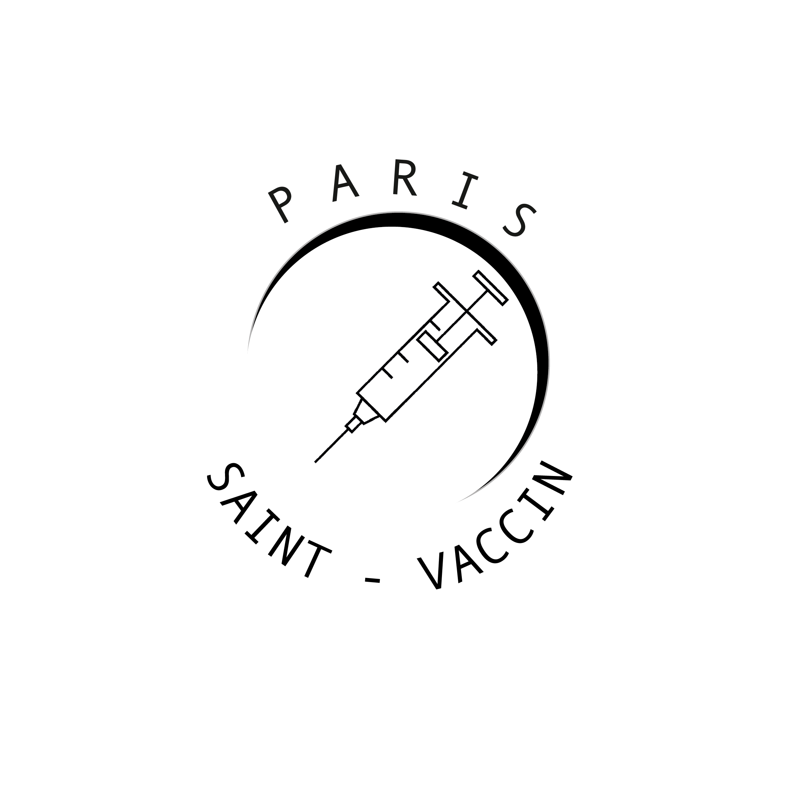

# Paris St. Vaccin

Projet collaboratif entre 3 personnes au sein de la Formation 1BCIA chez [Need For School](https://www.needfor-school.com).

## Pour commencer

Avoir installé [GIT](https://git-scm.com), [Composer](https://getcomposer.org) ainsi que de créer et d'ouvrir un nouveau dossier avec votre IDE favori ! (développer avec PHP Storm by JetBrains).

### Pré-requis

Ce qu'il est requis pour commencer avec votre projet...

- Installer [GIT](https://git-scm.com)
- Installer [Composer](https://getcomposer.org)

### Installation

1 - Exécuter cette commande après avoir créer un nouveau dossier et après l'avoir ouvert dans votre IDE : ``git init``

2 - Exécuter cette commande : ``git clone https://BRIETGAME@bitbucket.org/brietgame/parisstvaccin.git ``

Ensuite, vous obtiendrez tout le projet réalisé en *localhost*.

## Démarrage

**Attention, nous utilisons la technologie Sass pour compiler notre CSS. Afin de l'utiliser convenablement, il faut exécuter la commande suivante dans un nouveau terminal distinct de vos commandes GIT** : ``sass sass/style.scss assets/css/styles.css --watch``

## Fabriqué avec

_Outils utilisés :_
* [Bitbucket](https://bitbucket.org/) - Héberge le répertoire du projet
* [Animista](https://animista.net) - Librairie d'animations CSS
* [PHPStorm](https://www.jetbrains.com/fr-fr/phpstorm/) - Editeur de textes

## Versions

**Dernière version stable :** 1.0

**Dernière version :** 1.0

## Auteurs
* **Maxence BOSSIN** _alias_ [@Maxfab](#)
* **Alexis BRIET** _alias_ [@BRIETGAME](https://twitter.com/BRIETGAME)
* **Anais CRENIER** _alias_ [@AnaisCrenier](#)
* **Romain LALLEMENT** _alias_ [@𝑻𝒘_𝒀𝒂𝑩](#)
